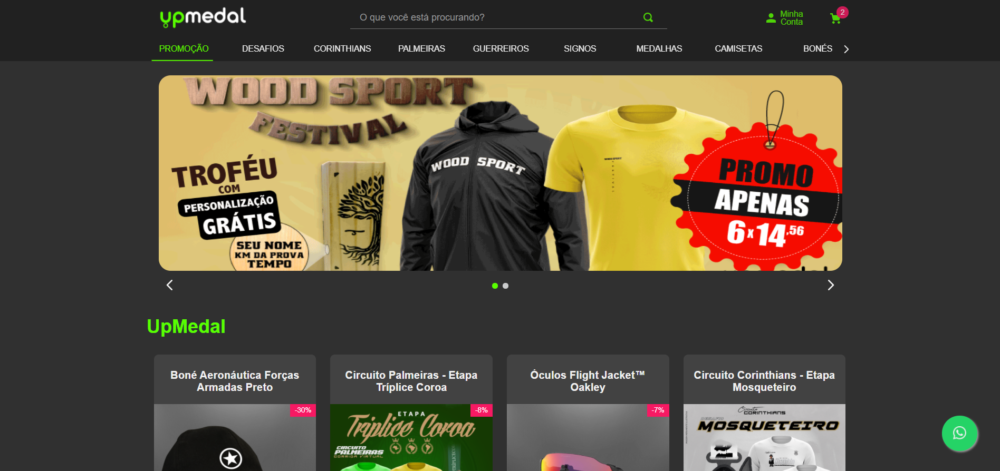
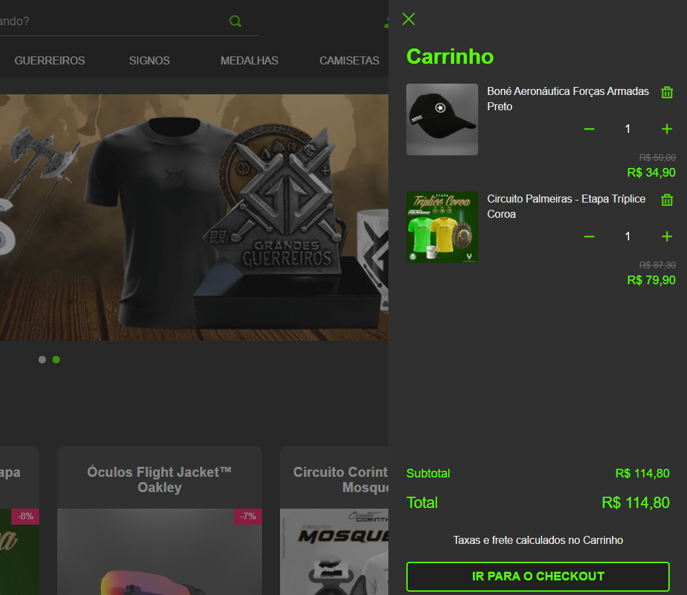
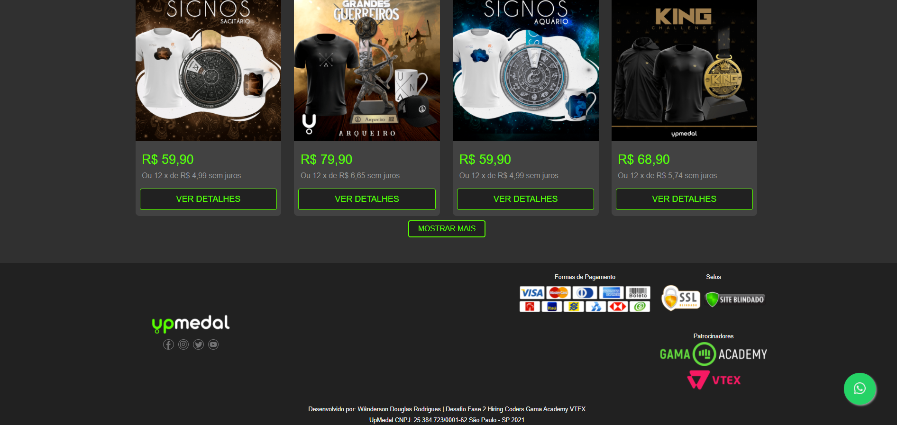

<h1 align="center">
    
</h1>

<h1 align="center">
    Tema UpMedal VTEX IO
</h1>

## 💻 Sobre o projeto

Projeto desenvolvido como desafio no HiringCoders Gama Academy VTEX.
Desenvolver uma reprodução do site www.upmedal.com.br feita com VTEX.IO e criar dois componentes React (um para Redirecionar para o Whatsapp e outro para captação de leads na AWS)

A Captação de Leads ainda não foi feita.

---

## 🛠 Tecnologias/Ferramentas

As seguintes ferramentas foram usadas na construção do projeto:

- CSS
- TypeScript
- NodeJS
- React
- VTEX.IO

---

## 🚀 Melhorias

As seguintes melhorias precisam ser feitas para aprimoramento do projeto

Principais Pontos de Melhoria:
 - Adição de mais componentes na página de produto
 - Responsividade
 - Página de Login
 - Página de Usuário
 - Melhoria no Header com Usuário logado
 - Formulário para captação de Leads

---

## 🚀 Imagens do Projeto

<h1 align="center">
    
</h1>

<h1 align="center">
    
</h1>

<h1 align="center">
    
</h1>

---

## 🦸 Autor

Desenvolvido por Douglas Rodrigues 👋🏽 [Entre em contato!](https://www.linkedin.com/in/douglas-rodrigues-pnz/)
